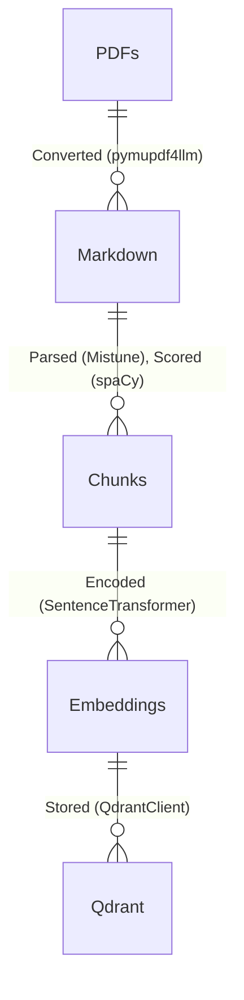
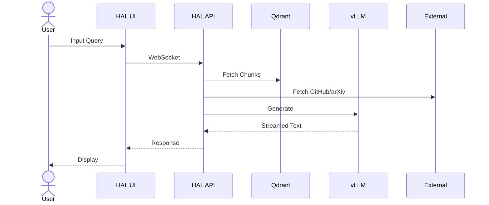

# HAL: Highly Adaptable Learning AI


HAL is a razor-sharp AI juggernaut, forged to obliterate tech queries with blistering speed and unerring precision, pulling from a sprawling, multi-format universe of technical docs. Powered by Retrieval-Augmented Generation (RAG), HAL streams answers faster than a photon blast through a *WarGames*-style CRT terminal—green phosphor blazing, scanlines humming. It’s a developer’s ultimate weapon, raiding GitHub and arXiv for external intel, wielding session memory like a steel trap, and extracting user facts on the fly for razor-edged, personalized strikes. With sentiment tuning its growl, WebSocket-fueled multi-user chaos on the horizon, and a relentless grip on compiler tech and beyond, HAL doesn’t just respond—it conquers.

## Features

- **Rapid Document Ingestion**: Devours stacks of tech docs in a flash, shredding low-value noise for a pristine knowledge core.
- **Real-Time Query Streaming**: Unleashes answers as they forge, leaving lag in the dust.
- **Session-Based Memory**: Locks conversation history in Qdrant’s vault, resetting on restart—lean and mean.
- **Scalable Architecture**: Flexes from tiny datasets to galactic content hoards without breaking a sweat.
- **Retro Terminal Interface**: Rocks a *WarGames*-vintage UI—whiter-cyan (#E0FFFF) text, live `█` cursor pulsing.

## Cross Platform UI


## System Architecture

### Embedding/Ingestion Flow (ERD)



### Runtime HAL Usage Flow



## Technology Stack

- **Core Libraries**: `pymupdf4llm` for text extraction, `SentenceTransformer` (`thenlper/gte-large`, 1024-dimensional) for embeddings, `Qdrant` for vector storage with HNSW indexing, `vLLM` (`microsoft/Phi-4-mini-instruct`) for generation, `FastAPI` for API domination, and `Tauri` for a cross-platform UI that hits like a freight train.
- **Architecture**: Retrieval-Augmented Generation (RAG) juiced by CUDA-powered embeddings and real-time LLM fury.
- **Hardware**: NVIDIA RTX 4080 (16GB VRAM), Intel i9-13900KF (20 cores), 128GB RAM—a beastly rig for HAL’s reign.
- **Environment**: Python 3.12.9 on WSL Ubuntu 22.04, dependencies wrangled by `uv`.

## Current State

- **Data**: Devours a hefty haul of tech docs—compilers, algorithms, Node.js, systems, data science, software architecture—into a lean, mean `hal_docs` arsenal.
- **Operation**: Built for solo glory, now flexing multi-user muscle via WebSockets—Phi-4 swap unleashed sharper answers.
- **Interface**: Rocks a clean Q&A flow—no prefixes, just raw truth—live Qdrant chunk counts and blazing timings on deck.

## Performance Highlights

- **Ingestion Speed**: Tears through tech docs in a heartbeat with CUDA fire.
- **Retrieval Latency**: Snags chunks from Qdrant’s depths in a blink—HNSW precision.
- **Query Response**: Streams answers at warp speed, maxing VRAM like a titan.
- **Scalability**: Scales from scraps to empires—HAL’s hunger knows no bounds.

## Usage

### Setup

```bash
uv venv                   # Forge the virtual lair
source .venv/bin/activate # Step into the arena
uv sync                   # Arm HAL with its weapons
```

### MongoDB

```bash
wget https://repo.mongodb.org/apt/ubuntu/dists/jammy/mongodb-org/8.0/multiverse/binary-amd64/mongodb-org-server_8.0.5_amd64.deb
sudo dpkg -i mongodb-org-server_8.0.5_amd64.deb
sudo systemctl status mongod
```

### OTel Collector

```bash
wget https://github.com/open-telemetry/opentelemetry-collector-releases/releases/download/v0.122.1/otelcol-contrib_0.122.1_linux_amd64.deb
sudo dpkg -i otelcol-contrib_0.122.1_linux_amd64.deb
sudo nano /etc/otelcol-contrib/config.yaml
sudo systemctl status otelcol-contrib
journalctl -u otelcol-contrib
```

### Launch HAL

```bash
./qdrant             # Ignite Qdrant’s core
uv run vllm_server   # Unleash vLLM’s inferno
uv run hal           # Summon HAL’s wrath
```

### Launch UI

```bash
cd hal-ui
npm run dev          # Fire up the Tauri beast
```

## License

Proprietary - see [LICENSE](docs/LICENSE) for details. All rights reserved by Jarrod Connolly.

Thanks to Grok (xAI) for code collaboration and development swagger—Nested Quotes-style fueling the grind.

## Attribution

### General Text Embeddings (GTE) Model (`thenlper/gte-large`)

@article{li2023towards,
  title={Towards general text embeddings with multi-stage contrastive learning},
  author={Li, Zehan and Zhang, Xin and Zhang, Yanzhao and Long, Dingkun and Xie, Pengjun and Zhang, Meishan},
  journal={arXiv preprint arXiv:2308.03281},
  year={2023}
}

### Phi-4-mini-instruct (`microsoft/Phi-4-mini-instruct`)

Built with Phi-4 - see [Microsoft Phi-4 License](https://huggingface.co/microsoft/Phi-4-mini-instruct/blob/main/LICENSE)