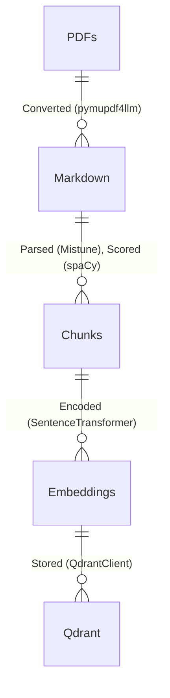
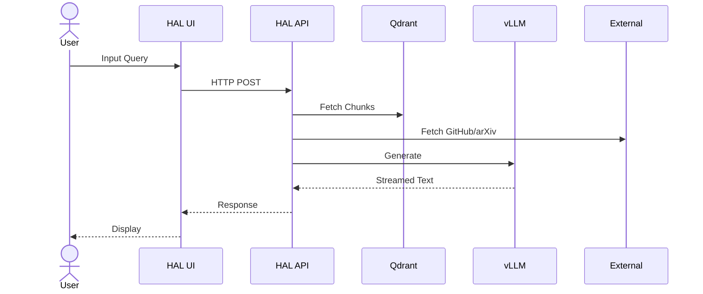

# HAL: Highly Adaptable Learning AI


HAL is a razor-sharp AI assistant, precision-crafted to deliver blazing-fast, pinpoint-accurate answers from a vast, multi-format galaxy of technical docs. Fueled by Retrieval-Augmented Generation (RAG), HAL streams real-time responses through a dripping-with-nostalgia WarGames-style CRT terminal—green phosphor glow, scanlines, and all. It’s a developer’s dream, effortlessly fetching external knowledge from the wilds of GitHub and arXiv, wielding internal conversation memory, and extracting user facts on the fly for tailored insights. With sentiment analysis tuning its tone, multi-user support via WebSockets, and a relentless focus on compiler tech and beyond, HAL doesn’t just answer—it dominates.


## Features

- **Rapid Document Ingestion**: Processes 36,972 chunks from 33 technical documents in 370s, filtering low-value chunks (<0.3) for a clean knowledge base.
- **Real-Time Query Streaming**: Delivers answers incrementally as they’re generated, minimizing wait times.
- **Session-Based Memory**: Retains conversation history within a session using Qdrant, resetting on restart for lightweight operation.
- **Scalable Architecture**: Handles growing datasets, from small collections to gigabytes of content, with consistent performance.
- **Retro Terminal Interface**: Features a minimalist, *WarGames*-style UI with whiter-cyan (#E0FFFF) text and a live `█` cursor.

## Cross Platform UI


## System Architecture

### Embedding/Ingestion Flow (ERD)


```mermaid
erDiagram
    PDFs ||--o{ Markdown : "Converted (pymupdf4llm)"
    Markdown ||--o{ Chunks : "Parsed (Mistune), Scored (spaCy)"
    Chunks ||--o{ Embeddings : "Encoded (SentenceTransformer)"
    Embeddings ||--o{ Qdrant : "Stored (QdrantClient)"
    PDFs
    Markdown
    Chunks
    Embeddings
    Qdrant
```

### Runtime HAL Usage Flow


```mermaid
sequenceDiagram
    actor U as User
    participant UI as HAL UI
    participant API as HAL API
    participant Q as Qdrant
    participant V as vLLM
    participant E as External
    U->>UI: Input Query
    UI->>API: HTTP POST
    API->>Q: Fetch Chunks
    API->>E: Fetch GitHub/arXiv
    API->>V: Generate
    V-->>API: Streamed Text
    API-->>UI: Response
    UI-->>U: Display
```
## Technology Stack

- **Core Libraries**: `pymupdf4llm` for text extraction, `SentenceTransformer` (`thenlper/gte-large`, 1024-dimensional) for embeddings, `Qdrant` for vector storage with HNSW indexing, `vLLM` (`meta-llama/Llama-3.2-3B-Instruct`) for generation, `FastAPI` for API serving, and `Textual` for terminal UI.
- **Architecture**: Retrieval-Augmented Generation (RAG) powered by CUDA-accelerated embeddings and real-time LLM inference.
- **Hardware**: NVIDIA RTX 4080 (16GB VRAM), Intel i9-13900KF (20 cores), 128GB RAM.
- **Environment**: Python 3.12.9 on WSL Ubuntu 22.04, dependencies managed via `uv`.

## Current State

- **Data**: Ingests 421MB across 33 technical documents (compilers, algorithms, Node.js, systems, data science, software architecture), yielding 36,972 chunks in `hal_docs`.
- **Operation**: Built as a single-user system, with a streamlined workflow from document ingestion to query response.
- **Interface**: Presents a clean, question-and-answer format without prefixes, displaying live Qdrant chunk counts and performance timings.

## Performance Highlights

- **Ingestion Speed**: Processes 36,972 chunks in 370s with CUDA acceleration.
- **Retrieval Latency**: Retrieves from 36,972 chunks in 0.05-0.09s via Qdrant HNSW.
- **Query Response**: Streams answers in 0.5-5s, peaking at 14.1GB VRAM.
- **Scalability**: Scales to 36,972 chunks in 370s, ready for larger datasets.

## Usage

### Setup

```bash
uv venv                   # Create virtual environment
source .venv/bin/activate # Activate it
uv sync                   # Install dependencies
```

### MongoDB

```bash
wget https://repo.mongodb.org/apt/ubuntu/dists/jammy/mongodb-org/8.0/multiverse/binary-amd64/mongodb-org-server_8.0.5_amd64.deb
sudo dpkg -i mongodb-org-server_8.0.5_amd64.deb
sudo systemctl status mongod
```

### OTel Collector

```bash
wget https://github.com/open-telemetry/opentelemetry-collector-releases/releases/download/v0.122.1/otelcol-contrib_0.122.1_linux_amd64.deb
sudo dpkg -i otelcol-contrib_0.122.1_linux_amd64.deb
sudo nano /etc/otelcol-contrib/config.yaml
sudo systemctl status otelcol-contrib
journalctl -u otelcol-contrib
```

### Launch HAL

```bash
./qdrant             # Start Qdrant
uv run vllm_server   # Launch vLLM API server
uv run hal           # Run HAL core
```

### Launch UI

```bash
cd hal-ui
npm run dev
```

## License

Proprietary - see [LICENSE](docs/LICENSE) for details. All rights reserved by Jarrod Connolly.

Thanks to Grok (xAI) for code collaboration and development support.

## Attribution

### General Text Embeddings (GTE) Model (`thenlper/gte-large`)

```
@article{li2023towards,
  title={Towards general text embeddings with multi-stage contrastive learning},
  author={Li, Zehan and Zhang, Xin and Zhang, Yanzhao and Long, Dingkun and Xie, Pengjun and Zhang, Meishan},
  journal={arXiv preprint arXiv:2308.03281},
  year={2023}
}
```

### Llama 3.2 (`meta-llama/Llama-3.2-3B-Instruct`)

Built with Llama - see [LICENSE_LLAMA](docs/LICENSE_LLAMA)
