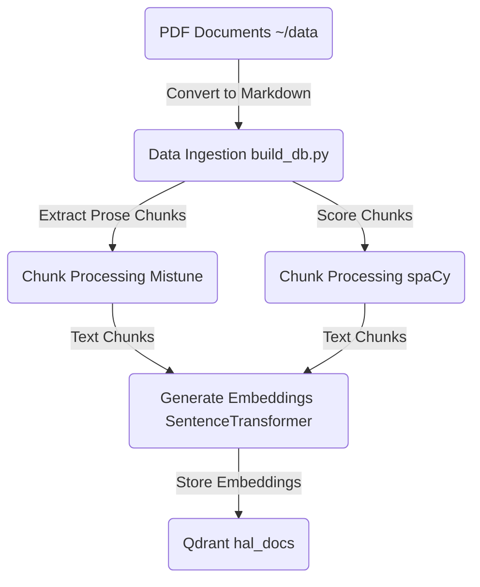
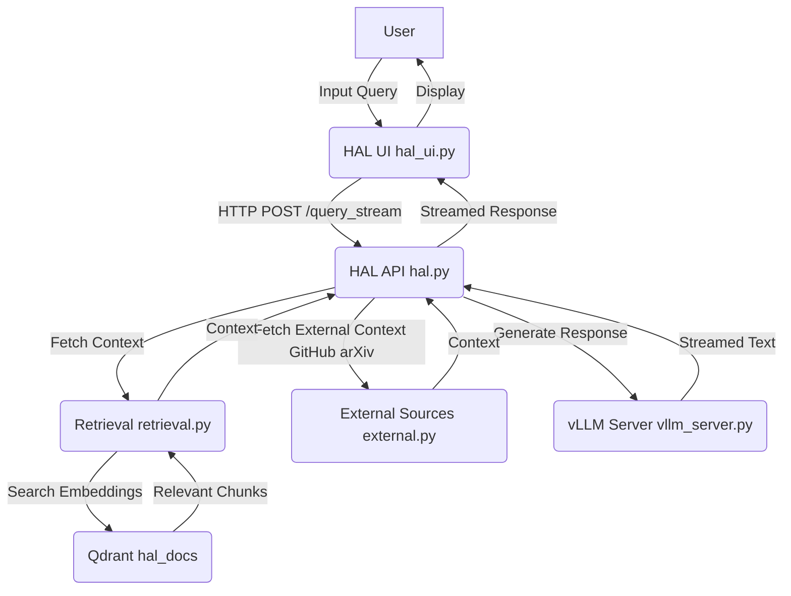

# HAL: Highly Adaptable Learning AI

HAL is a precision-engineered AI assistant designed to deliver concise, accurate answers from a corpus of technical documents—PDFs, DOCX, TXT, and Markdown files. Built for speed and efficiency, HAL leverages Retrieval-Augmented Generation (RAG) to provide real-time responses, styled with a retro *WarGames*-inspired terminal aesthetic. It’s optimized for developers seeking fast, reliable insights from complex technical literature—ingesting 421MB across 33 documents into 36,972 searchable chunks—with a focus on supporting compiler development and related technical domains.

## Features

- **Rapid Document Ingestion**: Processes 36,972 chunks from 33 technical documents in 370s, filtering low-value chunks (<0.3) for a clean knowledge base.
- **Real-Time Query Streaming**: Delivers answers incrementally as they’re generated, minimizing wait times.
- **Session-Based Memory**: Retains conversation history within a session using Qdrant, resetting on restart for lightweight operation.
- **Scalable Architecture**: Handles growing datasets, from small collections to gigabytes of content, with consistent performance.
- **Retro Terminal Interface**: Features a minimalist, *WarGames*-style UI with whiter-cyan (#E0FFFF) text and a live `█` cursor.

## System Architecture

### Embed Flow


```mermaid
graph TD
    A(PDF Documents ~/data) -->|Convert to Markdown| B(Data Ingestion build_db.py)
    B -->|Extract Prose Chunks| C(Chunk Processing Mistune)
    B -->|Score Chunks| D(Chunk Processing spaCy)
    C -->|Text Chunks| E(Generate Embeddings SentenceTransformer)
    D -->|Text Chunks| E
    E -->|Store Embeddings| F(Qdrant hal_docs)
```

## Query Flow


```mermaid
graph TD
    A[User] -->|Input Query| B(HAL UI hal_ui.py)
    B -->|HTTP POST /query_stream| C(HAL API hal.py)
    C -->|Fetch Context| D(Retrieval retrieval.py)
    D -->|Search Embeddings| E(Qdrant hal_docs)
    C -->|Fetch External Context GitHub arXiv| F(External Sources external.py)
    C -->|Generate Response| G(vLLM Server vllm_server.py)
    E -->|Relevant Chunks| D
    D -->|Context| C
    F -->|Context| C
    G -->|Streamed Text| C
    C -->|Streamed Response| B
    B -->|Display| A
```

## Technology Stack

- **Core Libraries**: `pymupdf4llm` for text extraction, `SentenceTransformer` (`thenlper/gte-large`, 1024-dimensional) for embeddings, `Qdrant` for vector storage with HNSW indexing, `vLLM` (`meta-llama/Llama-3.2-3B-Instruct`) for generation, `FastAPI` for API serving, and `Textual` for terminal UI.
- **Architecture**: Retrieval-Augmented Generation (RAG) powered by CUDA-accelerated embeddings and real-time LLM inference.
- **Hardware**: NVIDIA RTX 4080 (16GB VRAM), Intel i9-13900KF (20 cores), 128GB RAM.
- **Environment**: Python 3.12.9 on WSL Ubuntu 22.04, dependencies managed via `uv`.

## Current State

- **Data**: Ingests 421MB across 33 technical documents (compilers, algorithms, Node.js, systems, data science, software architecture), yielding 36,972 chunks in `hal_docs`.
- **Operation**: Built as a single-user system, with a streamlined workflow from document ingestion to query response.
- **Interface**: Presents a clean, question-and-answer format without prefixes, displaying live Qdrant chunk counts and performance timings.

## Performance Highlights

- **Ingestion Speed**: Processes 36,972 chunks in 370s with CUDA acceleration.
- **Retrieval Latency**: Retrieves from 36,972 chunks in 0.05-0.09s via Qdrant HNSW.
- **Query Response**: Streams answers in 0.5-5s, peaking at 14.1GB VRAM.
- **Scalability**: Scales to 36,972 chunks in 370s, ready for larger datasets.

## Usage

### Setup

```bash
uv venv                   # Create virtual environment
source .venv/bin/activate # Activate it
uv sync                   # Install dependencies from pyproject.toml
```

### Launch

```bash
./qdrant             # Start Qdrant (assumes binary in root)
uv run vllm_server   # Launch vLLM API server
uv run hal           # Run HAL core (RAG queries)
uv run hal_ui        # Open HAL UI
```

## License

Proprietary - see [LICENSE](docs/LICENSE) for details. All rights reserved by Jarrod Connolly.

Thanks to Grok (xAI) for code collaboration and development support.

## Attribution

### General Text Embeddings (GTE) Model (`thenlper/gte-large`)
@article{li2023towards,
  title={Towards general text embeddings with multi-stage contrastive learning},
  author={Li, Zehan and Zhang, Xin and Zhang, Yanzhao and Long, Dingkun and Xie, Pengjun and Zhang, Meishan},
  journal={arXiv preprint arXiv:2308.03281},
  year={2023}
}

### Llama 3.2 (`meta-llama/Llama-3.2-3B-Instruct`)
Built with Llama - see [LICENSE_LLAMA](docs/LICENSE_LLAMA)